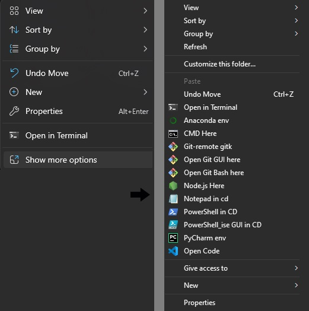
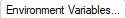
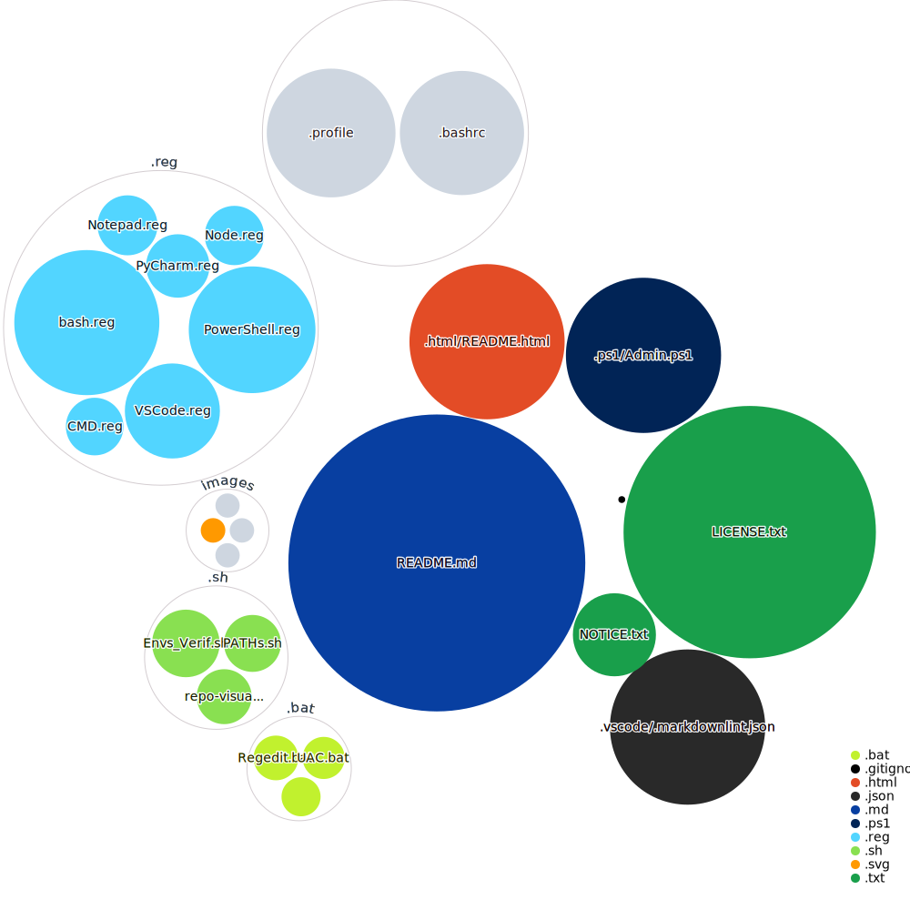

<h1 align="center" style="text-shadow: 2px 2px darkblue; color: white; text-align: center; text-decoration: underline;">

Context Menu Registries &#128194;
</h1>
<div align="left">
<a href="https://htmlpreview.github.io/?https://github.com/EstebanMqz/Context_Menu-Registries/blob/main/.html/README.html">
  
</a></div>

<div align="center" style="font-size: 18px; width: 100%; height: 100px; margin: 2px; border: 2px solid;">

Enable [<b><u>User/System Environment Variables<b></u>](https://learn.microsoft.com/en-us/windows/win32/procthread/environment-variables) to have [](https://anaconda.org)
[](https://learn.microsoft.com/en-us/windows-server/administration/windows-commands/cmd)
[](https://git-scm.com)
[](https://anaconda.org)
[](https://apps.microsoft.com/detail/9msmlrh6lzf3?hl=en-US&gl=US)
[](https://learn.microsoft.com/en-us/powershell/)
[](https://www.jetbrains.com/pycharm/)
[](https://code.visualstudio.com)
access in [<i>cd</i>](https://learn.microsoft.com/en-us/windows-server/administration/windows-commands/cd) ∀ &#128194;
</div>

<b> 1. UAC (User Account Control) </b><br>

+ <a href="#Admin"><i>1.1 Admin. Permissions</i></a><br>
+ <a href="#Secure"><i>1.2 Secure Desktop UAC</i></a><br>
+ <a href="#PATHs"><i>1.3 Variables & PATHs</i></a><br>

<b> 2. &#128194; Background Commands</b><br>

+ <a href="#Git"><i>2.1 Bash, GUI & gitk &nbsp; [](https://git-scm.com)</i></a><br>
+ <a href="#CMD"><i>2.2 Command Prompt &nbsp; [](https://learn.microsoft.com/en-us/windows-server/administration/windows-commands/cmd)</i></a><br>
+ <a href="#PowerShell"><i>2.3 PowerShell & GUI &nbsp; [](https://docs.microsoft.com/en-us/powershell/)</i></a><br>
+ <a href="#VSCode"><i>2.4 VSCode &nbsp; [](https://docs.microsoft.com/en-us/powershell/)</i></a><br>
+ <a href="#PyCharm"><i>2.5 Pycharm &nbsp; [](https://www.jetbrains.com/pycharm/)</i></a><br>
+ <a href="#Notepad"><i>2.6 Notepad &nbsp; [](https://icons8.com/icon/82ixf4KHn6za/notepad)</i></a><br>
+ <a href="#Node"><i>2.7 Node.js &nbsp; [](https://nodejs.org/en)</i></a><br>

<b> 3. &#128194; Enable User/System Environment Variables &amp; PATHs at Startup</b><br>

+ <a href="#Startup"><i>3.1 Modify [`~/.bashrc`](https://github.com/EstebanMqz/Context_Menu-Registries/blob/main/%24HOME/.bashrc) & [`~/profile`](https://github.com/EstebanMqz/Context_Menu-Registries/blob/main/%24HOME/.profile)</i></a><br>
+ <a href="#Envs-Dirs."><i>3.2 Verify Envs & Directories (source .bashrc to .profile)</i></a><br>
+ <a href="#Verification"><i>3.3 Verify Unix-like Environments in [`~/.bashrc`](https://github.com/EstebanMqz/Context_Menu-Registries/blob/main/%24HOME/.bashrc) & [`~/profile`](https://github.com/EstebanMqz/Context_Menu-Registries/blob/main/%24HOME/.profile) </i></a><br>
+ <a href="#Backup"><i>3.4 Check your PATHs and Dirs.</i></a><br>
+ <a href="#Result"><i>3.5 Check Results in Folder Backgrounds</i></a><br>
<div align= "center">
<b>Result:</b><br><br>


<br><br></div>

<div style="background-color: #d97707; height: 2px;"></div><br>

<h1 style="text-shadow: 2px 1px green; color: white; text-align: center; text-decoration: underline;">  1. User Account Control (UAC) </h1>
<br>

<section id="Admin">

#### 1.1 Grant `$Env:Username` Admin. permissions

Run [``Admin.ps1``](https://github.com/EstebanMqz/Registries/blob/main/.ps1/Admin.ps1).

``` powershell
#Powershell 
./Admin.ps1

#Out: 
Administrative Permissions to <$env:USERNAME>: Successful.
```

---
<section id="Secure">

#### 1.2 <i> Left-click</i> <b>[``UAC.bat``](https://github.com/EstebanMqz/Context_Menu-Registries/blob/main/.bat/UAC.bat) to enable secure desktop [UAC](https://learn.microsoft.com/en-us/windows/security/application-security/application-control/user-account-control/settings-and-configuration?tabs=intune).</b> </h3>

<div style="font-size: 13px;">
<i>Recommended:</i>

<b>[Secure dimmed desktop](https://learn.microsoft.com/en-us/windows/security/threat-protection/security-policy-settings/user-account-control-switch-to-the-secure-desktop-when-prompting-for-elevation)
</b></div>

<div style="font-size: 13px;">

<div align="left" style="font-size: 18px; width: 100%; height: 160px; margin: 1px; border: 1px solid;">
<Details open> <Summary> <h6>UAC options:</h6> </Summary>
   </ul>
   <div class="small-padding" style="font-size: 10px;">
   <ul>
      <li><b>0</b>: No prompt.</li>
      <li><b>1</b>: Windows settings changes .</li>
      <li><b>2</b>: Secure dimmed desktop.</li>
      <li><b>3</b>: Sys settings <i>not related</i> to Windows</li>
      <li><b>4</b>: Sys settings <i>not related</i> to Windows (no pw).</li>
   </ul></div>
</Details>
</div>

``` bat
Enter the password for Administrator: xxxxx
Value ConsentPromptBehaviorAdmin exists, overwrite(Yes/No)? Yes
```

</div>

---

#### 1.3 Add your [Environment Variables](https://learn.microsoft.com/en-us/windows/win32/procthread/environment-variables) & [PATHs](https://learn.microsoft.com/en-us/dotnet/standard/io/file-path-formats)

<section id="PATHs">

<div style="font-size: 13px;">

``` CMD
rem CMD
SystemPropertiesAdvanced
```

</div>

Click & edit in `Advanced System Settings` the button:<br>
<div align="center">
  <a href="https://learn.microsoft.com/en-us/windows/win32/procthread/environment-variables">
    
  </a>
</div><br>

<div style="font-size: 14px;">

Once opened, modify [PATHs.sh](https://github.com/EstebanMqz/Context_Menu-Registries/blob/main/.sh/PATHs.sh) file according to your PATHs & Dirs <i>(e.g)</i>:
<br>

``` bash
# Bash
./PATHs.sh

#Out:
# The PATHs of the programs are:
# C:\Program Files\nodejs\node.exe
# C:\Users\Esteban\.nvm\versions\node\v21.6.1\bin\node.exe
# C:\Program Files\Git\mingw64\bin\gitk
# C:\Program Files\Git\cmd\gitk.exe
# C:\Windows\System32\cmd.exe
# C:\Windows\System32\WindowsPowerShell\v1.0\powershell.exe
# C:\Users\Esteban\AppData\Local\JetBrains\Toolbox\scripts\pycharm.cmd
# C:\Program Files\Git\usr\bin\notepad
# C:\Windows\System32\notepad.exe
# C:\Windows\notepad.exe
# C:\Users\Esteban\AppData\Local\Microsoft\WindowsApps\notepad.exe
# C:\Users\Esteban\AppData\Local\Programs\Microsoft VS Code\Code.exe
# C:\Users\Esteban\AppData\Local\Programs\Microsoft VS Code\bin\code
# C:\Users\Esteban\AppData\Local\Programs\Microsoft VS Code\bin\code.cmd

# Icons PATHs are the following:
# C:\\\\Windows\\\\System32\\\\WindowsPowerShell1.0\\\\powershell.exe
# C:\\\\Windows\\\\System32\\\\WindowsPowerShell1.0\\\\powershell_ise.exe
# C:\\\\Program Files\\\\Git\\\\usiash.exe
# C:\\\\Windows\\\\System3ash.exe
# C:\\\\Usersteban\\\\AppData\\\\Local\\\\Microsoft\\\\WindowsAppash.exe
# C:\\\\Program Files\\\\Git

```

###### Recommended

[WSL](https://learn.microsoft.com/en-us/windows/wsl/install) [](https://learn.microsoft.com/en-us/windows/wsl/install)
</b></div>

<div style="background-color: #d97707; height: 2px;"></div><br>

<h1 style="text-shadow: 2px 1px orange; color: white; text-align: center; text-decoration: underline;">  2. Background Context & Commands</h1>
<br>

```CMD
Rem CMD
start regedit
```

Remove TrustedInstaller FullControl on <i>needed</i> <b>Registries</b>, grant it to <b>Administrator</b> manually in &nbsp; <a href="https://learn.microsoft.com/en-us/windows-server/administration/windows-commands/reg">
</a> <br>

<b>Download and Double-click .reg files: </b><br>
<i>Modify [regedit](https://learn.microsoft.com/en-us/troubleshoot/windows-server/performance/windows-registry-advanced-users) - [HKEY_CLASSES_ROOT](https://learn.microsoft.com/en-us/previous-versions/windows/it-pro/windows-server-2003/cc739822(v=ws.10)) accordingly to [`.reg keys`](https://github.com/EstebanMqz/Context_Menu-Registries/tree/main/.reg) in all flles</i>.
<br>

---
<b>1. Bash, GUI & gitk [](https://git-scm.com) </b><br>
<section id="Git">

Run [``Bash.reg``](https://github.com/EstebanMqz/Context_Menu-Registries/blob/main/.reg/bash.reg)  [``Git-Gui.reg``](https://github.com/EstebanMqz/Context_Menu-Registries/blob/main/.reg/bash.reg)  [``gitk.reg``](https://github.com/EstebanMqz/Context_Menu-Registries/blob/main/.reg/bash.reg) <br>

---
<b>2. Command Prompt &nbsp; [](https://learn.microsoft.com/en-us/windows-server/administration/windows-commands/cmd) <br>
<section id="CMD">

Run [``CMD.reg``](https://github.com/EstebanMqz/Registries/blob/main/.reg/CMD.reg)

---
<b>3. PowerShell & GUI [](https://docs.microsoft.com/en-us/powershell/)</b>&emsp;
<section id="PowerShell">

```powershell
$PS = [System.Diagnostics.Process]::GetCurrentProcess().MainModule.FileName; Start-Process explorer.exe (Split-Path $PS); $PS = ($PS + '').Replace('\', '\\'); Set-Clipboard -Value $PS; Write-Output $PS
```

Get Icon's PATHs <i>(double-back-slashed)<b>.exe and modify PATHs accordingly.</i>  
Run [``PowerShell.reg``](https://github.com/EstebanMqz/Context_Menu-Registries/blob/main/.reg/PowerShell.reg)<br>

---
<b>4. &nbsp; &nbsp; VSCode &nbsp; [](https://docs.microsoft.com/en-us/powershell/)</b><br>
<section id="VSCode">

Run [``VSCode.reg``](https://github.com/EstebanMqz/Context_Menu-Registries/blob/main/.reg/VSCode.reg)
<br>

---

<b>5. &nbsp; &nbsp; Pycharm &nbsp; [](https://www.jetbrains.com/pycharm/)</b><br>
<section id="PyCharm">

Run [``PyCharm.reg``](https://github.com/EstebanMqz/Context_Menu-Registries/blob/main/.reg/PyCharm.reg)

---

<b>6. &nbsp; &nbsp; Notepad  &nbsp; [](https://icons8.com/icon/82ixf4KHn6za/notepad)</b><br>

<section id="Notepad">

Run [``Notepad.reg``](https://github.com/EstebanMqz/Context_Menu-Registries/blob/main/.reg/Notepad.reg)

<b>7. &nbsp; &nbsp; Node.js &nbsp; [](https://nodejs.org/en)</b><br>

<section id="Node">

Run [``Node.reg``](https://github.com/EstebanMqz/Context_Menu-Registries/blob/main/.reg/Node.reg)

<i><b>Note:</b> To activate all [.reg](https://github.com/EstebanMqz/Context_Menu-Registries/blob/main/.reg) files at once, use the activator [Regedit.bat](https://github.com/EstebanMqz/Context_Menu-Registries/blob/main/.bat/Regedit.bat) (having Admin given full permissions in [HKEY_CLASSES_ROOT](https://learn.microsoft.com/en-us/previous-versions/windows/it-pro/windows-server-2003/cc739822(v=ws.10)))</i>

---
<div style="font-size: 14px;">

###### Recommended

<a href="https://learn.microsoft.com/en-us/powershell/module/microsoft.powershell.management/checkpoint-computer?view=powershell-5.1"></a>
or <a href="https://learn.microsoft.com/en-us/windows-server/administration/windows-commands/xcopy"></a>.

#### <u><b>Backup SSD</b></u>

Match your Drives according to [``external.bat``](https://github.com/EstebanMqz/Context_Menu-Registries/blob/main/.bat/external.bat) or modify it.

```bash
cd F: && label F: D  #Rename F to D 
./external.bat 
```

<i><b>Note:</b> Ignore modification alerts after backup.</i>
<br>

<div style="background-color: #d97707; height: 2px;"></div><br>

<h1 style="text-shadow: 1px 2px red; red: red; text-align: center; text-decoration: underline;">  3. Enable User/System Environment Variables &amp; PATHs at Startup</h1>
<br></div>
<section id="Startup">

1. Open [`~/.bashrc`](https://github.com/EstebanMqz/Context_Menu-Registries/blob/main/%24HOME/.bashrc) & [`~/profile`](https://github.com/EstebanMqz/Context_Menu-Registries/blob/main/%24HOME/.profile) and have them modified according to PATHs & directories.</i>

<br>

``` bash
#Bash: Create/Open ~/.profile && ~/.bashrc in $HOME.
cd $HOME && code ~/.profile && code ~/.bashrc
```

<br>
<section id="Envs-Dirs.">

2. Copy contents according to your environments and directories and source [~/.bashrc](https://github.com/EstebanMqz/Context_Menu-Registries/blob/main/%24HOME/.bashrc) to [~/.profile](https://github.com/EstebanMqz/Context_Menu-Registries/blob/main/%24HOME/.profile) :<br>

[``PATH.sh``](https://github.com/EstebanMqz/Context_Menu-Registries/blob/main/.sh/PATHs.sh) &rarr;
<a href="https://github.com/EstebanMqz/Context_Menu-Registries/blob/main/%24HOME/.bashrc"></a> &amp; <a href="https://github.com/EstebanMqz/Context_Menu-Registries/blob/main/%24HOME/.profile"></a>

<br>

3. Ensure that Unix-like Environments PATHs are loaded correctly in Startup files:<br>

<section id="Verification">

``` bash
./Envs_Verif.sh
# Directory /C/Program Files (x86)/NVIDIA Corporation/PhysX/Common exists.
# Directory /C/Windows/system32 exists.
# Directory /C/Program Files/MATLAB/R2021a/bin exists.
# Directory /C/Program Files/dotnet exists.
# Directory /C/Program Files/nodejs exists.
# Directory /C/php-8.2.9 exists.
# Directory /C/ProgramData/ComposerSetup/bin exists.
# Directory /C/Program Files/Git/cmd exists.
# Directory /C/Users/Esteban/AppData/Local/Programs/Python/Python311/Scripts does not exist.
# Directory /C/Users/Esteban/AppData/Local/Programs/Microsoft VS Code/bin exists.
# Directory /C/Windows/System32/WindowsPowerShell/v1.0 exists.
# Directory /C/Windows/System32/Wbem exists.
# Directory /C/Windows/System32/OpenSSH exists.
```

4. After rebooting check your PATHs & Directories.

<section id = "Backup">

```bash
#Bash
printenv && echo $PATH
#Directories & PATHs related to executables.
```

<section id = "Result">

5. Startup [.bashrc](https://www.gnu.org/software/bash/manual/html_node/Bash-Startup-Files.html) / [.profile](https://www.ibm.com/docs/en/zos/2.1.0?topic=shell-customizing-homeprofile) should enable Registries & Commands in 📁 Backgrounds in any [pwd](https://en.wikipedia.org/wiki/Pwd) :
<br>

<div align= "center">
<br>
</div><br>

<Details open> <Summary> <i style="font-size: 11px;"> Repo Visualization: </Summary>
<a name = "Repo-Visualization"></a><br>

[](https://mango-dune-07a8b7110.1.azurestaticapps.net/?repo=EstebanMqz%2FContext_Menu-Registries)

<div align = center>  
<!--  if local unfetched -->
<a href="https://mango-dune-07a8b7110.1.azurestaticapps.net/?repo=EstebanMqz%2FContext_Menu-Registries">
</a><br><br></div></Details>

<div style="font-size: 14px;">

<table>
  <tr>
    <td valign="middle">
      <a href="https://opensource.org/licenses/Apache-2.0">
        
      </a>
    </td>
    <td valign="middle">
      © Copyright 2024 <a href="https://github.com/EstebanMqz">EstebanMqz</a> - <a href="https://github.com/EstebanMqz/Context_Menu-Registries">Context Menu Registries</a> <i>(&#128194; Background Commands)</i>.
    </td>
  </tr>
</table>
</div>

<h3> References:</h3>

<div style="border: 1px solid ; padding: 20px; color:gray" align="center">
<a href="https://learn.microsoft.com/en-us/windows-server/administration/windows-commands/reg">
</a> &nbsp;
<a href="https://learn.microsoft.com/en-us/windows-server/administration/windows-commands/reg">
</a> &nbsp;
<a href="https://docs.kernel.org">
<br><br>
<a href="https://learn.microsoft.com/en-us/windows-server/administration/windows-commands/xcopy">
</a>
<a href="https://docs.microsoft.com/en-us/windows-server/administration/windows-commands/reg-query"></a>
<a href="https://www.gnu.org/software/bash/manual/bash.html">
</a>
<a href="https://docs.microsoft.com/en-us/windows/wsl/">
</a>
<a href="https://www.gnu.org/software/bash/manual/bash.html#Bash-Startup-Files"></a>
<a href="https://docs.microsoft.com/en-us/windows-server/administration/windows-commands/reg">
</a>
<a href="https://docs.microsoft.com/en-us/windows/win32/procthread/environment-variables">
</a>
<a href="https://learn.microsoft.com/en-us/windows/win32/shell/user-environment-variables">
</a>
<a href="https://learn.microsoft.com/en-us/dotnet/api/system.environment.setenvironmentvariable?view=net-8.0">
</a>

<h4>

WSL enabled OS [Directories](https://learn.microsoft.com/en-us/windows-server/administration/windows-commands/dir) &amp; [Environment-Variables](https://docs.microsoft.com/en-us/windows/win32/procthread/environment-variables).</b></h5>
</div><br><br>
<Details open>

<summary> <div b style="font-family: Arial, sans-serif; color: #c4c8ff; font-size: 18px;"> Business Inquiries:</b> </div> </summary>

[](https://estebanmqz.github.io/EstebanMqz/html/Resume.html)
[](https://www.linkedin.com/in/estebanmqz/)
[](https://tinyurl.com/BusinessNo)
<a href="https://mail.google.com/mail/?view=cm&fs=1&to=emarquez1895@gmail.com" target="Greetings Esteban I reviewed your work, skills and experience and I wish to schedule a Business Meeting with you." style="text-decoration: none;">
</a>
[](https://github.com/EstebanMqz?tab=repositories)
[](https://gitlab.com/EstebanMqz)

<div align= "left">
<div style="font-family: Arial, sans-serif; color: #c4c8ff; font-size: 15px;">
<br>

&#x26A1; Availability: <i> 24/7 on <b>WA</b> (Business Inquiries only) <br>
</Details>
</div>
