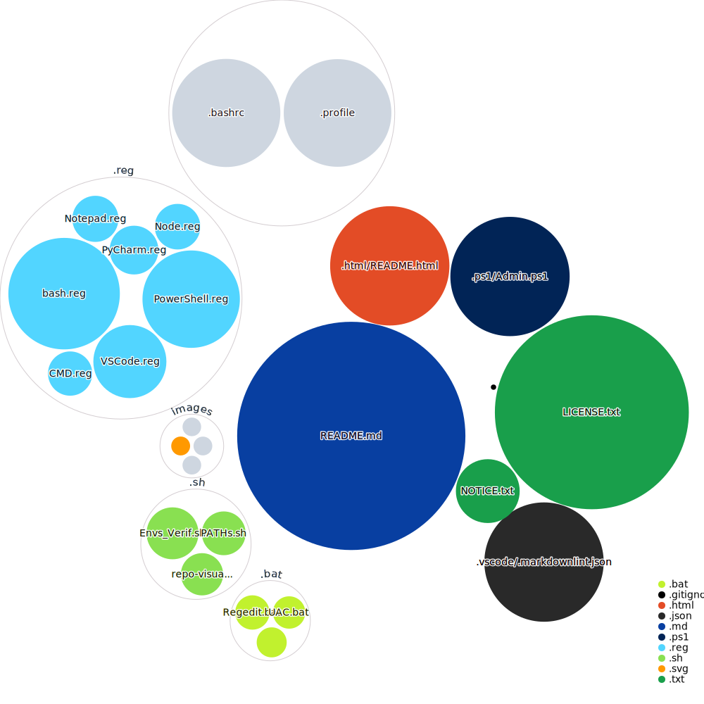

<h1 align="center" style="text-shadow: 2px 1px darkblue; color: white; text-align: center; text-decoration: underline;"> 

Background Context Menu Registries 
</h1>

<div align="right">

[](https://htmlpreview.github.io/?https://github.com/EstebanMqz/Registries/blob/main/.html/README.html)
</div>

### Quick Acess:
  
<div align= "center">

This repo is meant to enable <b><u>User/System Environment Variables<b></u> so that [](https://git-scm.com)&nbsp;[](https://learn.microsoft.com/en-us/windows-server/administration/windows-commands/cmd)&nbsp;&nbsp;[](https://www.jetbrains.com/pycharm/)&nbsp;[](https://icons8.com/icon/82ixf4KHn6za/notepad)</b> prompts in cd are displayed in all &#128194; Backgrounds: 


<br>
</div>
<div style="background-color: #d97707; height: 2px;"></div>

<h3 style="text-shadow: 2px 1px darkgreen; color: white; text-align: center; text-decoration: underline;"> 
User Account Control:
</h3>

#### 1. Grant your `<USERNAME>` Administrative Permissions.

Run [``Admin.ps1``](https://github.com/EstebanMqz/Registries/blob/main/.ps1/Admin.ps1) with Administrative privileges  

``` shell
#PS
cd $PATH
./Admin.ps1

Administrative Permissions to <$env:USERNAME>: Successful.
```


#### 2. <i> Left-click</i> <b>[``UAC.bat``](https://github.com/EstebanMqz/Registries/blob/main/.bat/UAC.bat) to enable secure desktop UAC.</b> </h3> 

<div style="font-size: 13px;">
<i>Recommended:</i> <b>Secure dimmed desktop</b> highest privileges.</div>

<div style="font-size: 10px;">
<Details open> <Summary> <h6>UAC options:</h6> </Summary>
   </ul>
   <div class="small-padding" style="font-size: 10px;"> 
   <ul>
      <li><b>0</b>: No prompt.</li>
      <li><b>1</b>: Windows settings changes .</li>
      <li><b>2</b>: Secure dimmed desktop.</li>
      <li><b>3</b>: Sys settings <i>not related</i> to Windows</li>
      <li><b>4</b>: Sys settings <i>not related</i> to Windows (no pw).</li>
   </ul></div>
</Details>
</div>

###### Option [2](https://learn.microsoft.com/en-us/windows/security/threat-protection/security-policy-settings/user-account-control-switch-to-the-secure-desktop-when-prompting-for-elevation)</i>:<br>
<i>

```
Enter the password for Administrator: xxxxx
Value ConsentPromptBehaviorAdmin exists, overwrite(Yes/No)? Yes
``` 
</i>

##### 3. Add your Environment Variables & PATHs with `Advanced System Settings`
``` CMD
REM CMD
SystemPropertiesAdvanced
```

##### 4. Use [``PATH.sh``](https://github.com/EstebanMqz/Registries/blob/main/.sh/PATH.sh) and [``System_Environments.sh``](https://github.com/EstebanMqz/Registries/blob/main/.sh/PATH.sh) your PATHs & directories.

``` bash
where node && where gitk && where cmd && where powershell && where pycharm && where notepad && where code
```
---

<h6>Recommended:</h6>

[WSL](https://learn.microsoft.com/en-us/windows/wsl/install) [](https://learn.microsoft.com/en-us/windows/wsl/install)</b>
</font>

<div style="font-size: 10px;">
Registry <b>Regex</b> &rarr; <i>Ctrl+Shift+F</i>

<a href="https://docs.microsoft.com/en-us/windows-server/administration/windows-commands/reg-query"></a> searches in the registry, use the following CMD command:

```CMD
:: CMD Registry Regex
reg query HKEY_CLASSES_ROOT /f "<regex_search>" /s /e
```


<div style="background-color: #d97707; height: 2px;"></div><br>

<h1 style="text-shadow: 2px 1px orange; color: white; text-align: center; text-decoration: underline;">  Background Context & Commands</h1> 
<div style="font-size: 14px;"> <br>

<i>Remove TrustedInstaller FullControl</i> on needed <b>Registries</b>, grant it to <b>Administrator</b> manually in [Registry Editor](https://learn.microsoft.com/en-us/troubleshoot/windows-server/performance/windows-registry-advanced-users)<br>

---
###### Recommended:
<a href="https://learn.microsoft.com/en-us/powershell/module/microsoft.powershell.management/checkpoint-computer?view=powershell-5.1"></a>
or <a href="https://learn.microsoft.com/en-us/windows-server/administration/windows-commands/xcopy"></a> with [``external.bat``](https://github.com/EstebanMqz/Registries/blob/main/.bat/external.bat)

<i>Backup HDD: to external SSD:</i>

```bash
./external.bat #(Assuming your HDD:C & external-SSD:D. Change .bat if not.)
cd D: & label D: SSD_ext  #Rename D to SSD_ext
```
---


```CMD
Rem CMD
start regedit
```

<b>Download and Double-click .reg files: </b><br>
<i>Modify [regedit](https://learn.microsoft.com/en-us/troubleshoot/windows-server/performance/windows-registry-advanced-users) - [HKEY_CLASSES_ROOT](https://learn.microsoft.com/en-us/previous-versions/windows/it-pro/windows-server-2003/cc739822(v=ws.10)) accordingly to [`reg keys`](https://github.com/EstebanMqz/Registries/tree/main/.reg)</i>.
<br>

</b>Note:</b> Ignore modification alerts <u>after backup.</u> </i>


<b>1. <b>Bash, GUI & gitk [](https://git-scm.com)  <br>

Run [``Bash.reg``](https://github.com/EstebanMqz/Registries/blob/main/.reg/bash.reg)  [``Git-Gui.reg``](https://github.com/EstebanMqz/Registries/blob/main/.reg/bash.reg)  [``gitk.reg``](https://github.com/EstebanMqz/Registries/blob/main/.reg/bash.reg) <br>

---

<b>2. Command Prompt &nbsp; [](https://learn.microsoft.com/en-us/windows-server/administration/windows-commands/cmd) <br>

Run [``CMD.reg``](https://github.com/EstebanMqz/Registries/blob/main/.reg/CMD.reg)

---

<b>3. PowerShell & GUI [](https://docs.microsoft.com/en-us/powershell/)</b>&emsp;

Get Icon's registry  <i>(double-back-slashed)<b></i>.exe</i> PATH:</b>

```powershell
#PowerShell terminal
#1. Open File Explorer and copy PS.exe Icon in ps1 format: 
#'https://github.com/EstebanMqz/Registries/blob/main/.reg/PowerShell.reg'
$PS = [System.Diagnostics.Process]::GetCurrentProcess().MainModule.FileName; Start-Process explorer.exe (Split-Path $PS); $PS = ($PS + '').Replace('\', '\\'); Set-Clipboard -Value $PS; Write-Output $PS
#e.g: 'C:\\WINDOWS\\System32\\WindowsPowerShell\\v1.0\\powershell.exe'
#2. Copy PS_ise.exe Icon PATH & do a .Replace('\', '\\\\'). 
#Confirm your syntaxes with the .reg/PowerShell.reg file 
```

The parent folder contains the [powershell.exe](https://learn.microsoft.com/en-us/powershell/module/microsoft.powershell.core/about/about_powershell_exe?view=powershell-5.1#parameters) & [power_ise.exe](https://learn.microsoft.com/en-us/powershell/module/microsoft.powershell.core/about/about_powershell_ise_exe?view=powershell-5.1)<br>
Run [``PowerShell.reg``](https://github.com/EstebanMqz/Registries/blob/main/.reg/PowerShell.reg)<br> 
<b><u>(modify PATHs accordingly)</b></u>.

---

<b>4. &nbsp; &nbsp; VSCode &nbsp; [](https://docs.microsoft.com/en-us/powershell/)</b><br>

[``VSCode.reg``](https://github.com/EstebanMqz/Registries/blob/main/.reg/VSCode.reg) 
<br>

---

<b>5. &nbsp; &nbsp; Pycharm &nbsp; [](https://www.jetbrains.com/pycharm/)</b><br>

[``PyCharm.reg``](https://github.com/EstebanMqz/Registries/blob/main/.reg/PyCharm.reg)

---

<b>6. &nbsp; &nbsp; Notepad  &nbsp; [](https://icons8.com/icon/82ixf4KHn6za/notepad)</b><br>

 [``Notepad.reg``](https://github.com/EstebanMqz/Registries/blob/main/.reg/Notepad.reg)

   </span><br>

<div style="background-color: #d97707; height: 2px;"></div><br>

<section id="config">
<h2 style="text-shadow: 2px 1px darkgreen; color: darkred; text-align: center; text-decoration: underline;"> <b> Enable <a href="https://learn.microsoft.com/en-us/windows/win32/procthread/changing-environment-variables"> User/System Environment Variables </a></b> &amp; <b><a href="https://phoenixnap.com/kb/linux-add-to-path#:~:text=PATH%20is%20an%20environment%20variable,to%20remove%20it%20in%20Linux.">PATHs</a></b> at <b>Startup</b></h2>

To be able to use the previously enabled [.reg](https://github.com/EstebanMqz/Registries/tree/main/.reg) files you will need to do the following:


1. Open [``$HOME``](https://github.com/EstebanMqz/Registries/blob/main/%24HOME/.bashrc) & Create/Open [``./bashrc``](https://github.com/EstebanMqz/Registries/blob/main/%24HOME/.bashrc) & [``./profile``](https://github.com/EstebanMqz/Registries/blob/main/%24HOME/.bashrc)
``` bash
#Bash: Create/Open ~/.profile && ~/.bashrc in $HOME.
cd $HOME && code ~/.profile && code ~/.bashrc
```
<br>

1. Copy contents according to your environments and directories:<br>

+ [``System_Environments.sh``](https://github.com/EstebanMqz/Registries/blob/main/.sh/System_Environments.sh) &rarr; <a href="https://github.com/EstebanMqz/Registries/blob/main/%24HOME/.profile"></a><br>

+ [``PATH.sh``](https://github.com/EstebanMqz/Registries/blob/main/.sh/PATH.sh) &rarr; 
<a href="https://github.com/EstebanMqz/Registries/blob/main/%24HOME/.bashrc"></a>
<br><br>

3. Add at the end of [`~/.profile`](https://github.com/EstebanMqz/Registries/blob/main/%24HOME/.profile) the following command:

``` bash
#./profile
#<'script'>

source ~/.bashrc 
```
<br>

4. Ensure that Environments Startup PATHs are loaded correctly by running:<br>

$PS = [System.Diagnostics.Process]::GetCurrentProcess().MainModule.FileName; Start-Process explorer.exe (Split-Path $PS); $PS = ($PS + '').Replace('\', '\\'); Set-Clipboard -Value $PS; Write-Output $PS

``` bash
#Bash

./PATH.sh 
# Personal Output (according to PATHs): 
# Directory /C/Program Files (x86)/NVIDIA Corporation/PhysX/Common exists.
# Directory /C/Windows/system32 exists.
# Directory /C/Program Files/MATLAB/R2021a/bin exists.
# Directory /C/Program Files/dotnet exists.
# Directory /C/Program Files/nodejs exists.
# Directory /C/php-8.2.9 exists.
# Directory /C/ProgramData/ComposerSetup/bin exists.
# Directory /C/Program Files/Git/cmd exists.
# Directory /C/ProgramData/Anaconda3/Scripts exists.
# Directory /C/Users/Esteban/AppData/Local/Programs/Python/Python311/Scripts exists.
# Directory /C/Users/Esteban/AppData/Local/Programs/Microsoft VS Code/bin exists.
# Directory /C/Windows/System32/WindowsPowerShell/v1.0 exists.
# Directory /C/Windows/System32/Wbem exists.
# Directory /C/Windows/System32/OpenSSH exists.
```

5. After rebooting check your PATHs & Directories. 

```bash
#Bash
printenv && echo $PATH
#Directories & PATHs related to executables.
```

6. Startup [.bashrc](https://github.com/EstebanMqz/Registries/blob/main/$HOME/.bashrc.sh) / [.profile](https://github.com/EstebanMqz/Registries/blob/main/$HOME/PATH.sh) should enable Registries & Commands in 📁 Backgrounds in any [pwd](https://en.wikipedia.org/wiki/Pwd):

<div align= "center">
<br>
</div><br>


<Details open> <Summary> <i style="font-size: 11px;"> Repo Visualization: </Summary>
<a name = "Repo-Visualization"></a><br>

[](https://mango-dune-07a8b7110.1.azurestaticapps.net/?repo=EstebanMqz%2FRegistries)

<div align = center>  
<!--  if local unfetched -->
<a href="https://mango-dune-07a8b7110.1.azurestaticapps.net/?repo=EstebanMqz%2FRegistries">
</a><br><br></div></Details>

<div style="font-size: 14px;">

<table>
  <tr>
    <td valign="middle">
      <a href="https://opensource.org/licenses/Apache-2.0">
        
      </a>
    </td>
    <td valign="middle">
      © Copyright 2024 <a href="https://github.com/EstebanMqz">EstebanMqz</a> - <a href="https://github.com/EstebanMqz/Registries">Registries</a> <i>(Context Menus & Commands)</i>.
    </td>
  </tr>
</table>
</div>


<h3> References:</h3>

<div style="border: 1px solid ; padding: 20px; color:gray" align="center">
<a href="https://learn.microsoft.com/en-us/windows-server/administration/windows-commands/reg">
</a> &nbsp;
<a href="https://learn.microsoft.com/en-us/windows-server/administration/windows-commands/reg">
</a> &nbsp;
<a href="https://docs.kernel.org">
<br><br>
<a href="https://learn.microsoft.com/en-us/windows-server/administration/windows-commands/xcopy">
</a>
<a href="https://docs.microsoft.com/en-us/windows-server/administration/windows-commands/reg-query"></a>
<a href="https://www.gnu.org/software/bash/manual/bash.html">
</a>
<a href="https://docs.microsoft.com/en-us/windows/wsl/">
</a>
<a href="https://www.gnu.org/software/bash/manual/bash.html#Bash-Startup-Files"></a>
<a href="https://docs.microsoft.com/en-us/windows-server/administration/windows-commands/reg">
</a>
<a href="https://docs.microsoft.com/en-us/windows/win32/procthread/environment-variables">
</a>
<a href="https://learn.microsoft.com/en-us/windows/win32/shell/user-environment-variables">
</a>
<a href="https://learn.microsoft.com/en-us/dotnet/api/system.environment.setenvironmentvariable?view=net-8.0">
</a>

<h4>

WSL enabled OS [Directories](https://learn.microsoft.com/en-us/windows-server/administration/windows-commands/dir) &amp; [Environment-Variables](https://docs.microsoft.com/en-us/windows/win32/procthread/environment-variables).</b></h5>
</div><br><br>
<Details open>

<summary> <div b style="font-family: Arial, sans-serif; color: #c4c8ff"> Business Inquiries:</b> </div> </summary>

[](https://estebanmqz.github.io/EstebanMqz/html/Resume.html)
[](https://www.linkedin.com/in/esteban-m65381722210212839/)
[](https://tinyurl.com/2y86e2wa)
<a href="mailto:emarquez1895@gmail.com" style="text-decoration: none;"></a>
[](https://github.com/EstebanMqz?tab=repositories)
[](https://gitlab.com/EstebanMqz)


<div align= "left">
<div style="font-family: Arial, sans-serif; color: #c4c8ff; font-size: 15px;"> 

&#x26A1;⚡Availability: <i> 24/7 on <b>WA</b> (business inquiries only) <br>
<div style="text-align: center;">
</b> <span style="color: #1b7521"> (password):</i> <b>"Marquez"</b></span><br></div>
</Details>
</div>


